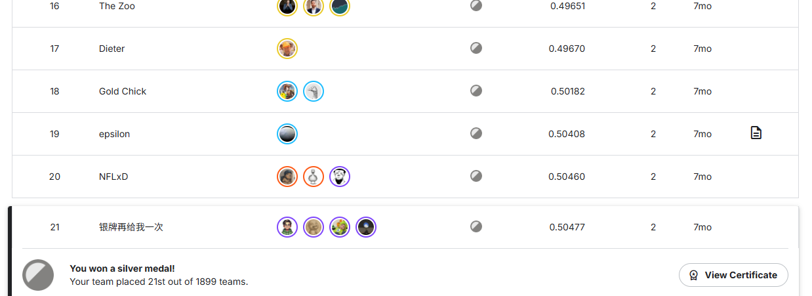

# NFL Big Data Bowl 2026 - Prediction

> Kaggle 竞赛：[NFL Big Data Bowl 2026 - Prediction](https://www.kaggle.com/competitions/nfl-big-data-bowl-2026-prediction)

## 🏆 竞赛成绩

**第 21 名 / 1899 支队伍**（Top ~1.1%）



本项目提供两种深度学习模型来预测 NFL 比赛中球员的移动轨迹：

| 模型 | 文件 | 说明 |
|------|------|------|
| **ST-GRU** | `519-ST-GRU.py` | 基于 SpatioTemporal GRU 的序列预测模型，融合空间注意力机制与傅里叶特征编码 |
| **ST-Transformer** | `519-STTransformer.py` | 基于 SpatioTemporal Transformer 的序列预测模型，更强的时空建模能力 |

## 环境要求

- Python 3.9+
- PyTorch 2.0+（支持 CUDA）
- 详见 [requirements.txt](requirements.txt)

## 快速开始

### 安装依赖

```bash
pip install -r requirements.txt
```

### 数据准备

将 Kaggle 竞赛数据放置在 `./nfl-big-data-bowl-2026-prediction/` 目录下，结构如下：

```
nfl-big-data-bowl-2026-prediction/
├── train/
│   ├── input_2023_w01.csv
│   ├── output_2023_w01.csv
│   ├── ...
│   ├── input_2023_w09.csv
│   └── output_2023_w09.csv
└── test/
    └── ...
```

### 训练模型

```bash
# 使用 ST-GRU 模型训练
python 519-ST-GRU.py --mode train

# 使用 ST-Transformer 模型训练
python 519-STTransformer.py --mode train
```

### 推理预测

```bash
# 使用 ST-GRU 模型推理
python 519-ST-GRU.py --mode infer

# 使用 ST-Transformer 模型推理
python 519-STTransformer.py --mode infer
```

### 命令行参数

| 参数 | 说明 | 默认值 |
|------|------|--------|
| `--mode` | 运行模式：`train` 或 `infer` | `infer` |
| `--model_path` | 模型保存/加载路径 | `./saved_models_rnn` |
| `--use_cache` | 使用缓存的序列数据 | `True` |
| `--no_cache` | 强制重新构建序列 | — |

## 方法概述

### 特征工程

- 方向统一化：将所有右向进攻镜像为左向，便于模型学习
- 坐标变换：将绝对坐标转换为相对于球落点的相对坐标
- 高级特征：速度分量、加速度分量、动量、动能、空间位置特征等
- 时空序列构建：将每场比赛构建为 `[B, T, N, F]` 格式的时空序列

### 模型架构

#### ST-GRU（时空门控循环单元）
- Fourier Feature Encoder：傅里叶特征编码
- RBF Encoder：径向基函数编码
- Frame Spatial Attention：帧级空间注意力
- Relative Position Bias：相对位置偏置
- Temporal Huber Loss：时序 Huber 损失函数

#### ST-Transformer（时空 Transformer）
- 多头自注意力机制
- 空间与时间维度分层建模
- Temporal Huber Loss：时序 Huber 损失函数

### 训练策略

- 5/10 折 GroupKFold 交叉验证
- Early Stopping（patience=30）
- 学习率 1e-3，Batch Size 128
- 窗口大小 8，隐藏维度 128
- 多随机种子集成

## 项目结构

```
.
├── 519-ST-GRU.py          # ST-GRU 模型（主模型）
├── 519-STTransformer.py   # ST-Transformer 模型
├── requirements.txt       # Python 依赖
├── .gitignore            # Git 忽略规则
├── README.md             # 本文件
├── log/                  # 运行日志（自动生成）
│   └── YYYYMMDD_HHMMSS/  # 按时间戳组织的日志
├── saved_models_rnn/     # 模型保存目录
└── nfl-big-data-bowl-2026-prediction/  # 竞赛数据（需自行下载）
```

## 致谢

- [NFL Big Data Bowl 2026](https://www.kaggle.com/competitions/nfl-big-data-bowl-2026-prediction) 竞赛主办方
- Kaggle 社区

## License

MIT License
